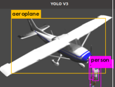

Part 1 Total simulation 
=======================

Total simulation is a simulation where all components are simulated. This includes the world, the flight computer, the ground control station, the companion computer, and the camera + AI algorithms.

1 Ardupilot (Intelligent Quads) youtube series
----------------------------------------------

I got my start with total simulation thanks to an incredible `video series put together by Intelligent Quads <https://www.youtube.com/playlist?list=PLy9nLDKxDN683GqAiJ4IVLquYBod_2oA6>`_ 4 years ago. I could not have made such fast progress without his series. That series was the only (genuinely) step-by-step intro to the drone world that I found (my version of his series is more up-to-date and easier to follow).

This kind of simulation is valuable because it allows to test the whole system in a controlled environment. It is also useful to test the system in extreme conditions that are difficult to reproduce in real life.

The simulation covers the following:

1.1 Core (SITL, Gazebo, ROS): The flight computer (FC) controls all surfaces (which are just the rotors). Simple Mavlink commands are sent to FC to fly the copter. Therefore copter reaction to flight commands can be simulated accurately. Ground control stations (QGC, MP) are computer based anyway. The CC (companion computer) runs several protocols (MAVROS, MAVLINK, MAVPROXY) that can be simulated accurately.

1.2 C++ mission as ROS node: The CC runs C++ routines on a ROS node to direct the drone on a mission.

1.3a AI Yolo object recognition: A basic example using simulated components.

1.3b Lidar object avoidance: A basic example using simulated components.

1.1.4 Drone swarm. A basic example using simulated components.

5 Flight planners. Using Mission planner and QGroundControl to plan missions.

2 PX4 simulation
----------------------------------------------

Core (SITL, Gazebo, ROS).

3 Matlab simulation
----------------------------------------------

3.1 Matlab UAV toolbox.

3.2 Matlab AI sim.

