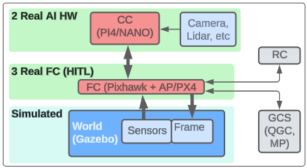
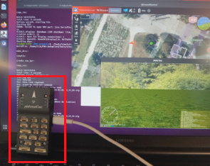

Part 3 HITL 
===========

In part 3 a real Pixhawk (AP/PX4) (below in red) is used. The rest of the copter components (frame, motors, IMU, GPS, motor control, etc) are all simulated.

HITL is described for PX4, Ardupilot, and Matlab.

PX4
----

xxxx

Ardupilot
-------------

xxxx

Matlab
-----------

Matlab is used to simulate the world (sensor inputs, flight dynamics, etc).

